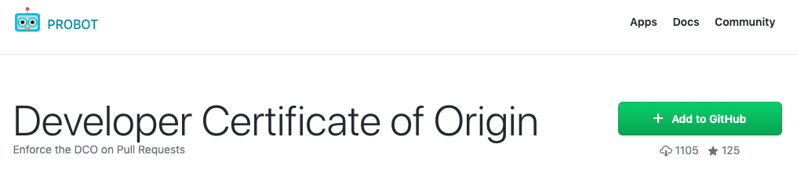
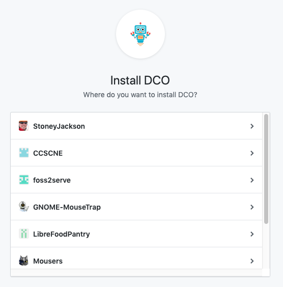
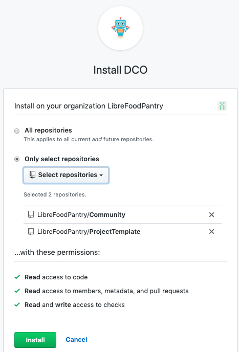
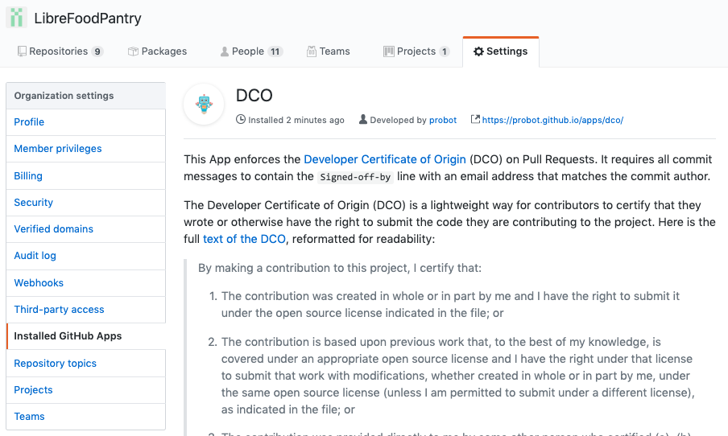
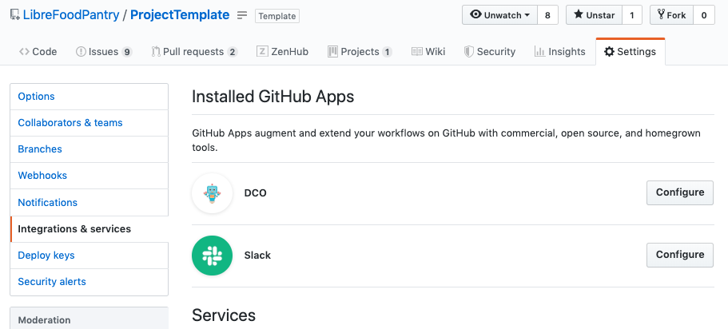
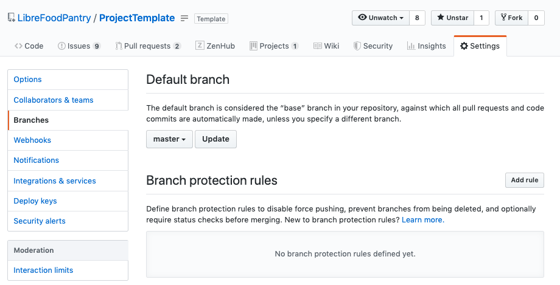
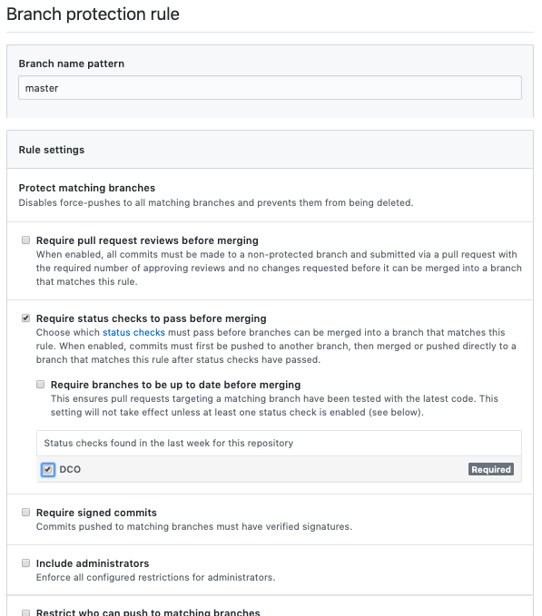
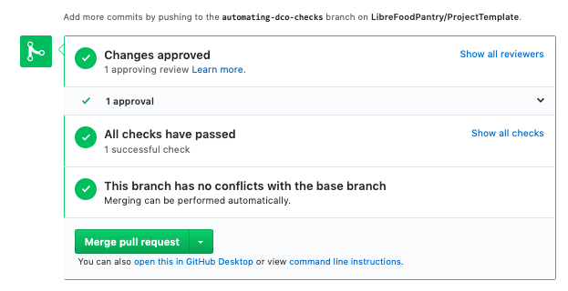
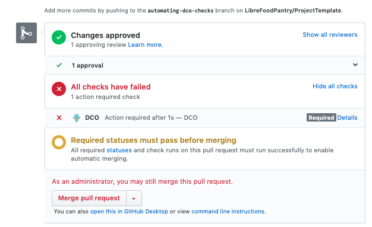

# Automating DCO Checks

Checking that each commit in a merge-request has a DCO sign-off
can be automated. This should be done on the main upstream
project for a project, not on forks. That means someone with appropriate
permissions (e.g., a trustee or possibly a shop manager) must enable DCO checks.

## GitHub

In GitHub, DCO checks are enabled by a 3rd party app: [Probot's DCO bot](https://probot.github.io/apps/dco/). Before you can enable DCO checks on a repository, you must have permissions to install 3rd party apps in the organization that contains that repository. Currently, that means your account must be an owner of that organization.

1. Log into GitHub

2. Add Probot to your GitHub account by navigating to [Probot's DCO bot](https://probot.github.io/apps/dco/) and clicking `Add to GitHub`
<br><br><br>

3. Select organization to install the DCO bot
<br><br><br>

4. Select repositories in which you want the DCO bot installed and click `Install`.
<br><br><br><br>
You'll land on the `Installed GitHub Apps` page under `Settings` of the organization you selected in (3). This confirms that the PDO bot has been installed in this organization.
<br><br><br><br>
Scrolling down on that page you can see (and change) which repositories the DCO bot is installed into. More, you can confirm that Probot is installed in each repository by navigating to each repository's `Integrations & services` page under its `Settings`.
<br><br><br>

5. Enable Probot on each repository by navigating to each repository's `Branches` page under its `Settings`.
<br><br><br><br>
Add a rule for the `master` branch. Type `master` for `Branch name pattern`, enable `Require status checks to pass before merging`, enable `DCO`, and click `Create`.
<br><br><br>

Now the PDO check will run on each pull-request after each commit. If all of the commits have a `Signed-off-by` line, then the check will pass.



Alternatively, if any commits do not have a `Signed-off-by` line, the DCO check will fail.



To install the DCO bot in other organizations by returning to step (2).

To install the DCO bot in other repositories within an organization that has the bot installed, navigate to `Installed GitHub Apps` in `Settings` in the organization and select the repository, and then configure that repository as in step (5).

## GitLab Gold
To enable DCO checks on GitLab, enable a Push Rule for the project that checks each commit for the DCO sign-off by going to `Settings` and `Repository` then entering the following regular expression in the `Commit message` box:

```
Signed-off-by: \w+ \w+ <.+@.+\..+>
```
<br><br>

- Note this will require every commit for the project to be signed (including merge commits). If this is not done, an error will be displayed in the GitLab web UI or in the command line when trying to push an un-signed commit to a branch or master.

---
Copyright (C) 2019 The LibreFoodPantry Developers.
Permission is granted to copy, distribute and/or modify this document
under the terms of the GNU Free Documentation License, Version 1.3
or any later version published by the Free Software Foundation;
with no Invariant Sections, no Front-Cover Texts, and no Back-Cover Texts.
A copy of the license is included in the section entitled "GNU
Free Documentation License". If not, see
<https://www.gnu.org/licenses/fdl-1.3.txt>.
