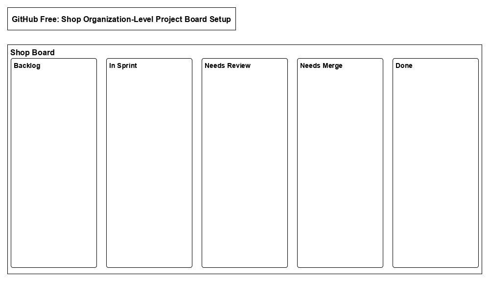
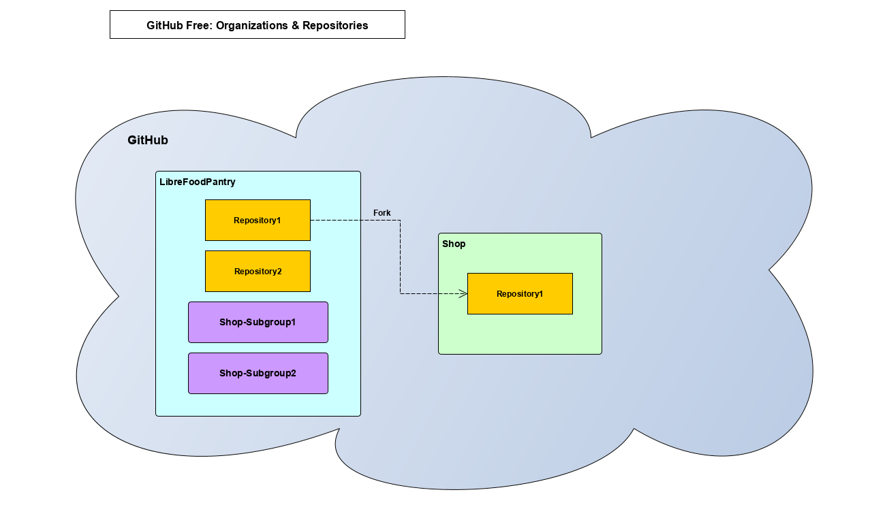
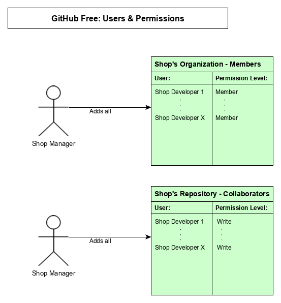

# GitHub Free Setup:

This document is a guide for Shop Managers on setting up a new shop organization on GitHub that will be contributing to a LibreFoodPantry (LFP) project

## Setting up the shop's GitHub organization:

### Shop Manager:

1. Create a new GitHub organization for the shop

## Setting up the shop's organization-level project board:

### Shop Manager:

1. Create a new shop organization-level project board to coordinate work across the shop

2. Add the appropriate columns to the shop board by clicking "Add column" in this order (in order on the board from left to right):

    1. Backlog
    2. In Sprint
    3. Needs Review
    4. Needs Merge
    5. Done

- Note these columns are our recommendations from our preferred workflow, they can be changed to better suit your shop's workflow  

### Shop organization-level project board diagram:

## Setting up the repository:

### Shop Manager:

1. Fork the repository you will be working on from the LibreFoodPantry organization to the shop organization

### GitHub organizations & respositories diagram:

## Setting up the shop's user permissions:

### Shop Manager:

1. Add the Shop Developers to the shop organization with member permissions

2. Add the Shop Developers to the forked repository as contributors with write permissions

### Users & permissions diagram:

---
Copyright (c) 2019 The LibreFoodPantry Developers.
Permission is granted to copy, distribute and/or modify this document
under the terms of the GNU Free Documentation License, Version 1.3
or any later version published by the Free Software Foundation;
with no Invariant Sections, no Front-Cover Texts, and no Back-Cover Texts.
A copy of the license is included in the section entitled "GNU
Free Documentation License". If not, see
<https://www.gnu.org/licenses/fdl-1.3.txt>.