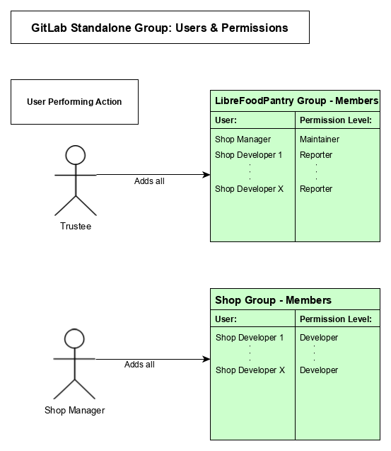
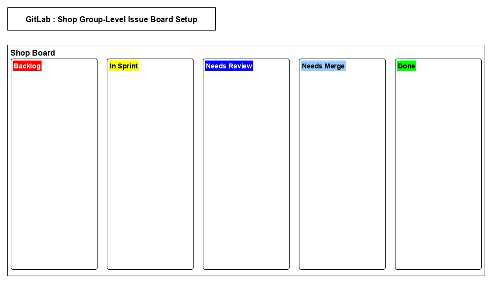
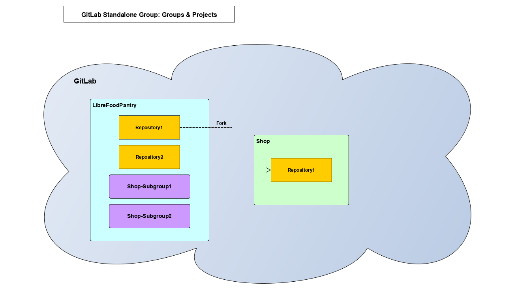

# GitLab Free Setup:

This document is a guide for Shop Managers on setting up a new shop group on GitLab that will be contributing to a LibreFoodPantry (LFP) project

## Setting up user permissions and the GitLab shop group:

### Trustee:

1. Add the Shop Manager to the LFP group with maintainer permissions

2. Add the Shop Developers to the LFP group with reporter permissions

### Shop Manager:

1. Create a new GitLab group for the shop

2. Add the Shop Developers to the shop group with developer permissions

### Users & permissions diagram:

## Setting up the shop group-level issue board:

### Shop Manager:

1. Go to the default Development issue board in the shop group

2. Add a new column by clicking "Add list" and create a new group label (and column) for each of the following (in order on the board from left to right):
    1. Backlog
    2. In Sprint
    3. Needs Review
    4. Needs Merge
    5. Done

- You may need to click on the label in the add list menu for the list to be added to the board

- Note these columns are our recommendations from our preferred workflow, they can be changed to better suit your shop's workflow  

### Shop group-level issue board diagram:

## Setting up the project:

### Shop Manager:

1. Fork the repository you will be working on from the LFP group to the shop group

### GitLab groups & projects diagram:

---
Copyright (c) 2019 The LibreFoodPantry Developers.
Permission is granted to copy, distribute and/or modify this document
under the terms of the GNU Free Documentation License, Version 1.3
or any later version published by the Free Software Foundation;
with no Invariant Sections, no Front-Cover Texts, and no Back-Cover Texts.
A copy of the license is included in the section entitled "GNU
Free Documentation License". If not, see
<https://www.gnu.org/licenses/fdl-1.3.txt>.